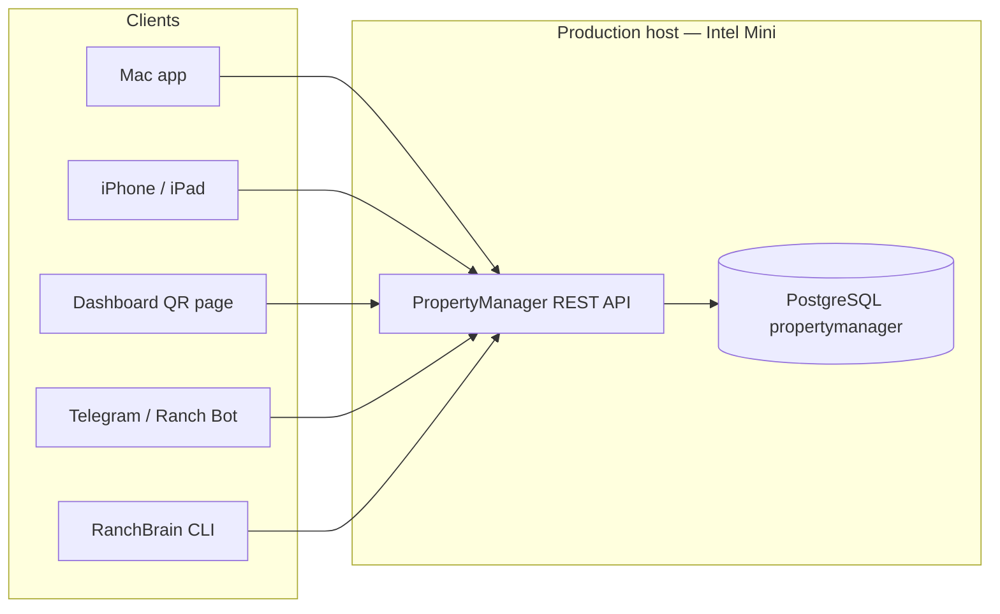

# PropertyManager Asset Architecture

Version: 1.1  
Status: **Phase 3 deployed on production Intel Mini**  
Authority: Requirements in [PropertyManager Foundational Requirements](../foundation/PROPERTY_MANAGER_FOUNDATIONAL_REQUIREMENTS.md)  
Last Updated: 2026-07-29

---

## Purpose

Track operating meters (runtime hours, mileage, cycles) for ranch equipment and vehicles. Connect preventive-maintenance schedules to meter intervals from manufacturer manuals. Provide one shared REST API for all client surfaces.

**Phase 3 deployed on production Intel Mini (2026-07-29).** See `reports/propertymanager/phase3-production-evidence.md`.

---

## Design principles

- **Postgres is the system of record** (production Intel Mini). Clients never connect to Postgres directly.
- **REST API is the only integration boundary** for Mac, iOS, Dashboard, Telegram, and RanchBrain CLI.
- **Auto-sync.** Mac and iPhone read/write through the API; local JSON cache is offline-derived only.
- **Dashboard-first QR entry.** Scanning a label opens a mobile web page; write actions require auth beyond the QR token (see [QR access policy](#qr-access-policy)).
- **Five-minute learning.** Asset pages show current reading and remaining until next service.
- **Manufacturer manual is PM source of truth.** Meter intervals are stored at manual import and drive meter-based schedules.
- **Audit-first meter history.** Every reading is reconstructable; corrections append new rows.

---

## Client topology

All clients talk to the PropertyManager REST API only. Postgres is reachable only from the API service on the host.



| Client                           | Role                                                                                                     |
| -------------------------------- | -------------------------------------------------------------------------------------------------------- |
| Mac                              | Asset admin, manual import with meter intervals, meter entry, completion meter capture, mapping approval |
| iPhone / iPad                    | Field meter entry, voice, QR deep link                                                                   |
| Dashboard `/pm/asset/<qr_token>` | QR landing, meter display, authenticated update                                                          |
| Telegram                         | Natural-language meter updates (via API)                                                                 |
| RanchBrain CLI                   | Display current meter and PM remaining from API                                                          |

Local JSON cache on Mac/iOS: read-through / write-behind against API; **not** a second system of record.

---

## Entity model

### `assets`

Canonical ranch asset registry. Join key to RanchBrain JSON is `external_id` (e.g. `EQ-DEERE-MOWER-001`).

| Column                                                  | Notes                                                         |
| ------------------------------------------------------- | ------------------------------------------------------------- |
| `id`                                                    | UUID primary key                                              |
| `external_id`                                           | Unique RanchBrain asset id                                    |
| `ranchbrain_guid`                                       | Optional link to JSON `guid`                                  |
| `name`, `manufacturer`, `model`, `category`, `location` | Display and voice matching                                    |
| `aliases`                                               | JSON array of nicknames                                       |
| `qr_token`                                              | Opaque routing token for QR URLs — **not** an auth credential |
| `is_active`                                             | Soft lifecycle                                                |
| `meter_proposed_type`, `meter_proposed_unit`            | Set at import; pending operator review                        |
| `meter_activated_at`                                    | Null until operator confirms meter defaults                   |

### `asset_meter`

One row per asset (1:1). Active only after operator confirms proposed defaults at import.

| Column              | Notes                                                           |
| ------------------- | --------------------------------------------------------------- |
| `meter_type`        | `runtime_hours`, `mileage`, `cycles`, or `none`                 |
| `current_value`     | Latest **chronologically** accepted reading in current epoch    |
| `unit`              | `hrs`, `mi`, or `cycles`                                        |
| `latest_reading_at` | Timestamp of reading that set `current_value`                   |
| `meter_epoch`       | Incremented on replacement or rollover; isolates reading chains |
| `row_version`       | Optimistic concurrency for updates                              |

**Proposed defaults at import** (operator must confirm before activation):

| Category             | Proposed `meter_type` | Proposed `unit` |
| -------------------- | --------------------- | --------------- |
| Equipment            | `runtime_hours`       | `hrs`           |
| Vehicles / Vehicle   | `mileage`             | `mi`            |
| Tractor, Shop, other | `none`                | —               |

### `asset_meter_reading`

Append-only history. Corrections and rejections are new rows; accepted rows are never UPDATEd or DELETEd.

| Column                 | Notes                                                                  |
| ---------------------- | ---------------------------------------------------------------------- |
| `id`                   | UUID primary key                                                       |
| `asset_id`             | FK to `assets`                                                         |
| `meter_epoch`          | Epoch at entry time                                                    |
| `meter_type`           | Snapshot at entry                                                      |
| `unit`                 | Snapshot at entry                                                      |
| `value`                | Decimal-safe numeric                                                   |
| `reading_at`           | Operator-entered or completion time (`timestamptz`)                    |
| `created_at`           | Server insert time                                                     |
| `entry_method`         | `manual`, `voice`, `qr`, `api`, `telegram`, `completion`               |
| `status`               | `accepted`, `rejected`, `corrected` (see semantics below)              |
| `previous_reading_id`  | Prior accepted reading in same epoch (null for first in epoch)         |
| `corrects_reading_id`  | When correcting a prior accepted reading                               |
| `correction_reason`    | `replacement`, `rollover`, `correction` when value < previous in epoch |
| `usage_since_previous` | Server-computed delta within epoch                                     |
| `operator_id`          | Authenticated operator (nullable for integrations)                     |
| `integration_id`       | Registered integration identity (Telegram, CLI, etc.)                  |
| `idempotency_key`      | Unique per asset + key; dedupe retries                                 |
| `note`                 | Optional free text                                                     |

**Status semantics:**

- `accepted` — contributes to history and may update `current_value` if chronologically latest
- `rejected` — preview declined or validation failed; audit only
- `corrected` — marks a superseding row; original remains; `corrects_reading_id` points to superseded accepted reading

### Task extensions (`maintenance_tasks`)

| Column                                          | Notes                                                        |
| ----------------------------------------------- | ------------------------------------------------------------ |
| `asset_id`                                      | FK to `assets`                                               |
| `schedule_kind`                                 | `calendar`, `meter`, or `both`                               |
| `meter_interval_value`, `meter_interval_unit`   | From manufacturer manual — never converted to days           |
| `last_done_meter_value`, `next_due_meter_value` | Maintained by recalc engine                                  |
| Calendar fields                                 | `warning_days`, `next_due` — unchanged for calendar / hybrid |

**Hybrid (`both`):** Use only when manual specifies "whichever comes first." Engine evaluates calendar due and meter due independently; task is due when **either** threshold is met.

### Completion extensions (`maintenance_completions`)

| Column                      | Notes                                            |
| --------------------------- | ------------------------------------------------ |
| `meter_value_at_completion` | Confirmed or newly entered meter at service time |
| `meter_reading_id`          | FK to reading created or linked on completion    |
| `operator_id`               | Who confirmed the meter reading                  |

### RanchBrain mapping (`asset_task_mapping_proposals`)

Review queue — **no auto-apply**.

| Column                       | Notes                             |
| ---------------------------- | --------------------------------- |
| `ranchbrain_task_ref`        | Source task identifier            |
| `proposed_asset_id`          | Suggested asset FK                |
| `match_rationale`            | area, item, text similarity, etc. |
| `confidence`                 | Score for operator sorting        |
| `status`                     | `pending`, `approved`, `rejected` |
| `reviewed_by`, `reviewed_at` | Operator audit                    |

Approved rows create or update `maintenance_tasks.asset_id`; rejected rows are retained for audit.

---

## Recalculation rules

### Current meter value

After every **accepted** reading:

1. Sort accepted readings in the asset's current `meter_epoch` by `reading_at ASC`, `created_at ASC`.
2. Set `asset_meter.current_value` and `latest_reading_at` from the **last** row in that ordering **only if** the new reading is that last row.
3. Backdated insertions that are not chronologically latest **do not** change `current_value`.

### Usage deltas

Within the same `meter_epoch`, recompute `usage_since_previous` for all accepted readings in chronological order after any insert or acceptance.

### PM remaining (meter schedules)

After every accepted reading or task completion that affects meter state:

```
remaining_meter = next_due_meter_value - current_meter_value
overdue_meter   = current_meter_value >= next_due_meter_value
```

On task complete with meter schedule (after operator confirms meter):

- `last_done_meter_value = meter_value_at_completion`
- `next_due_meter_value = last_done_meter_value + meter_interval_value`

Calendar `next_due` recalculation unchanged for `calendar` / `both` schedules. **Never** derive calendar dates from meter hour intervals.

### Meter epoch changes

On **replacement** or **rollover** confirmation:

1. Increment `asset_meter.meter_epoch`.
2. First reading in new epoch has `previous_reading_id = NULL`.
3. Do not compute `usage_since_previous` across epoch boundaries.

---

## Lower-reading workflow

Two-step flow; single POST with `correction_reason` alone is **rejected**.

### Step 1 — Preview (`POST .../meter-readings` or dedicated preview endpoint)

Request includes `value`, `reading_at`, `entry_method`, optional `idempotency_key`.

If `value < previous_accepted_in_epoch` and no confirmed correction:

**Response 409** structured body:

```json
{
  "code": "LOWER_READING_CONFIRMATION_REQUIRED",
  "previous_value": "1250.5",
  "proposed_value": "12.5",
  "options": ["replacement", "rollover", "correction"],
  "preview_token": "<short-lived token>"
}
```

### Step 2 — Confirm (`POST .../meter-readings/confirm`)

Body includes `preview_token`, `correction_reason`, `operator_id`, optional `note`.

- Creates `asset_meter_reading` with `status=accepted`, `previous_reading_id`, operator identity.
- On `replacement` or `rollover`: increment `meter_epoch` before persisting reading.
- On `correction`: set `corrects_reading_id` if superseding a specific row.

---

## Maintenance completion flow

1. Client fetches live meter from `GET /assets/<id>` (not local cache alone).
2. UI displays current reading and prompts: **Confirm** or **Enter new reading**.
3. If new reading differs or cache was stale, create reading first (standard or confirm flow).
4. Complete task with `meter_value_at_completion` and `meter_reading_id`.
5. Recalc PM meter fields.

**Forbidden:** silently submitting completion with cached/stale meter without operator acknowledgment.

---

## REST API contract (Phase 1 target)

Base path: `/v1/` on PropertyManager API port (dev VM first). Production host: Intel Mini after Phase 3 gate.

### Cross-cutting

| Header / field             | Purpose                                    |
| -------------------------- | ------------------------------------------ |
| `Authorization`            | Bearer or session token for mutating calls |
| `Idempotency-Key`          | Duplicate-safe retries                     |
| `If-Match` / `row_version` | Optimistic concurrency on meter update     |

Errors:

```json
{
  "code": "VALIDATION_ERROR",
  "message": "Human-readable summary",
  "field": "value",
  "details": [{ "code": "...", "message": "..." }]
}
```

Values: decimal strings in JSON (e.g. `"1250.5"`) to avoid float drift.

Timestamps: ISO 8601 with timezone offset; stored as `timestamptz`.

Lists: cursor pagination `?cursor=<opaque>&limit=50`.

### Assets

- `GET /v1/assets` — list with embedded meter summary and PM remaining
- `GET /v1/assets/<id>` — detail + linked tasks
- `GET /v1/assets/by-external-id/<external_id>`
- `GET /v1/assets/by-qr/<qr_token>` — **read-only** asset summary for QR landing; write requires separate auth
- `POST /v1/assets`, `PATCH /v1/assets/<id>`
- `POST /v1/assets/<id>/activate-meter` — operator confirms proposed meter defaults

### Meter readings

- `GET /v1/assets/<id>/meter-readings?cursor=&limit=50`
- `POST /v1/assets/<id>/meter-readings` — create; may return 409 preview for lower reading
- `POST /v1/assets/<id>/meter-readings/confirm` — lower-reading confirmation

### Mapping (RanchBrain)

- `GET /v1/mapping-proposals?status=pending` — review report
- `POST /v1/mapping-proposals/<id>/approve`
- `POST /v1/mapping-proposals/<id>/reject`

### Voice parse

- `POST /v1/meter-readings/parse` — `{ "text": "..." }` → `{ asset_id, value, unit, confidence }`

### Health

- `GET /health` — includes `api_version`, `schema_version` (`006` as of Phase 1), `api_process`, `postgres_reachable`, and `schema_available` (required tables present). Returns HTTP 503 when Postgres or schema checks fail; client body stays sanitized (diagnostics in logs).

### WSGI runtime (development VM)

Flask remains the app framework. Normal service operation uses **Gunicorn** (not Flask `app.run` / debug / reloader):

| Piece            | Path                                                                                                 |
| ---------------- | ---------------------------------------------------------------------------------------------------- |
| WSGI entry       | `tools/property_manager/api/wsgi.py` → `application`                                                 |
| Gunicorn target  | `wsgi:application` (WorkingDirectory = `tools/property_manager/api`)                                 |
| Config           | `tools/property_manager/api/gunicorn.conf.py` (2 sync workers, bind `:5062`, timeout 120s)           |
| Launcher         | `tools/property_manager/api/run_api.sh`                                                              |
| Dev systemd unit | `tools/property_manager/deploy/propertymanager-api.service`                                          |
| Runbook          | [PropertyManager API Development Runbook](../foundation/PROPERTY_MANAGER_API_DEVELOPMENT_RUNBOOK.md) |

DB default is docker-exec-per-query (process-safe across workers). Migrations stay explicit operator actions — never on worker import. Production Intel Mini units are unchanged until operator approval.

### Phase 1 implementation notes (dev VM)

| Area                                            | Status                      |
| ----------------------------------------------- | --------------------------- |
| Migration 006 audit fields                      | Implemented                 |
| `/v1/` asset and meter endpoints                | Implemented                 |
| Lower-reading preview + confirm                 | Implemented                 |
| Backdated reading recalc                        | Implemented                 |
| Idempotency-Key + cursor pagination             | Implemented                 |
| Optimistic locking (`row_version` / `If-Match`) | Implemented                 |
| Proposed meter + activate-meter                 | Implemented                 |
| Mapping proposals + CLI                         | Implemented                 |
| Dashboard QR auth policy                        | Implemented (PIN / API key) |
| Completion confirm-or-enter                     | Implemented on API          |
| Mac/iOS client wiring                           | Phase 2 complete (dev VM)   |
| Full test matrix (concurrency, offline sync)    | Phase 3 prerequisites       |

---

## QR access policy

| Surface                                     | Anonymous QR token                                              | Authenticated operator |
| ------------------------------------------- | --------------------------------------------------------------- | ---------------------- |
| Asset name, location, current meter display | Allowed on dashboard if operator enables public read            | Allowed                |
| Submit meter reading                        | **Denied** — requires session, PIN, or signed short-lived token | Allowed                |
| Asset metadata edit                         | **Denied**                                                      | Allowed                |

QR URL format: `/pm/asset/<qr_token>` — token identifies asset for routing only.

---

## Migration and rollout (dev-first)

### Phase 1 — Development VM only

1. Apply schema migration (audit fields, `meter_epoch`, mapping proposals) — **dry-run first**
2. Run RanchBrain asset import with **proposed** meter defaults (not auto-activated)
3. Generate mapping report; operator approves matches in dev
4. Re-import manufacturer manuals for meter intervals
5. Execute full [test matrix](../foundation/PROPERTY_MANAGER_FOUNDATIONAL_REQUIREMENTS.md#test-matrix-required-before-production)

### Phase 3 — Production Intel Mini (after operator authorization)

1. Backup production Postgres
2. Apply tested migration from dev
3. Deploy API version pinned in acceptance evidence
4. Enable dashboard QR (with auth policy)
5. Mac rebuild + iOS deploy against production API
6. Optional Telegram meter path

Each step requires rollback notes in the operations runbook. **No production step without Phase 2 acceptance evidence from dev VM.**

---

## RanchBrain join

RanchBrain JSON assets include `propertymanager_asset_id` and `asset_id`. PropertyManager Postgres owns operational meters and meter-based PM. Join key: `propertymanager.assets.external_id` = RanchBrain `asset_id`.

Task→asset linking uses the mapping proposal workflow; see [RanchBrain Architecture](../RanchBrain-Architecture.md).

---

## Related documents

- [PropertyManager Foundational Requirements](../foundation/PROPERTY_MANAGER_FOUNDATIONAL_REQUIREMENTS.md)
- [PropertyManager API Development Runbook](../foundation/PROPERTY_MANAGER_API_DEVELOPMENT_RUNBOOK.md)
- [RanchBrain Architecture](../RanchBrain-Architecture.md)
- [OpenClaw Development Directive](../foundation/OPENCLAW_DEVELOPMENT_DIRECTIVE.md)
- Deprecated alias: [PROPERTYMANAGER_ASSETS_AND_METERS.md](PROPERTYMANAGER_ASSETS_AND_METERS.md) (pointer only)

---

## Phase 0 → Phase 1 handoff

| Deliverable                                      | Owner                  | Blocker      |
| ------------------------------------------------ | ---------------------- | ------------ |
| Operator sign-off on this doc + requirements doc | Operator               | Phase 0 gate |
| Schema DDL on dev VM                             | Engineering            | 3, 4, 8      |
| API `/v1/` implementation                        | Engineering            | 10, 11, 12   |
| Preview/confirm lower reading                    | Engineering            | 5            |
| Backdated recalc engine                          | Engineering            | 4            |
| Completion confirm-or-enter (all clients)        | Engineering            | 6            |
| Mapping report UI/CLI                            | Engineering            | 9            |
| Test matrix evidence pack                        | Engineering + Operator | 13           |
| Production rollout                               | Operator authorized    | 1            |
